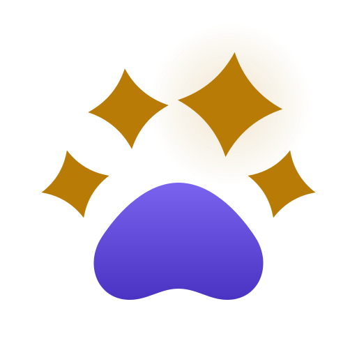

<p align="center">
  <picture>
    <source media="(prefers-color-scheme: dark)" srcset="spec/brand/paw-star.svg">
    
  </picture>
</p>

# Pawlaris

**Pet care for one family, under a night sky.**

A self-hosted, offline-first Android app for looking after the pets you share
a home with: who was fed, who got their medicine, who has been walked, and
who did it. Built for two people and five pets, to cost nothing a month.


[Spec](spec/README.md) ·
[Requirements](spec/02-spec.md) ·
[Screens](spec/09-screens.md) ·
[Architecture](spec/05-architecture.md) ·
[Backlog](spec/08-tasks.md) ·
[Reviews](docs/reviews)

> [!IMPORTANT]
> Pawlaris is being built in the open and is not usable yet. The foundation
> phase is under way: the three packages build, lint and test, and nothing a
> family could use exists so far. The [backlog](spec/08-tasks.md) shows
> exactly where it stands.

## What Pawlaris Is

A household with several pets runs on small, repeated acts that are easy to
double up on or forget. Did the cat get her pill, or did we both assume the
other did it? Pawlaris answers that from either phone, in the same second it
happens.

The name is Polaris with a paw. The pets it was made for are Aurora, Asteria,
Aelin and Andrômeda — four cats — and Katarina, a dog. So the app has one
visual idea, the night sky: every pet is a star, a finished task is a star
lit, and a finished day is a complete constellation.

It is a small product on purpose: one family, a server that fits in 1 GB of
memory, and no account anywhere that could send a bill.

## The Five Pillars

Every decision the spec leaves open is settled by these, in this order.

| # | Pillar | What it means |
|---|---|---|
| 1 | **Stable** | It never loses a tap, a dose record or a walk, and never shows a state the server refused. |
| 2 | **Instant** | A tap changes the screen in the same interaction, with no network in the way. The other phone knows within seconds. |
| 3 | **Light** | Few dependencies, each the leanest choice for its job. A small APK, little memory, an idle JS thread. |
| 4 | **Beautiful and alive** | A night sky with motion wherever it means something, drawn on the UI thread. |
| 5 | **Light and dark** | Deep space and dawn are both first-class. Nothing is designed for one theme and tolerated in the other. |

Stability outranks speed, speed outranks weight, and all three outrank
ornament. An effect that drops frames or drains the battery is removed, not
optimized later.

## What It Will Do

All of this is specified, requirement by requirement, in
[`spec/02-spec.md`](spec/02-spec.md). None of it is built yet.

**Pets**

- A profile for each pet, with a photo, weight history and a chart.
- A health timeline: vaccines, medication, vet visits, symptoms, procedures.

**Tasks**

- Recurring tasks — feeding, medication, hygiene, litter, play — done once
  for every pet together or once per pet, assigned to a person or left open.
- One tap to complete, with undo. Optional photo proof.
- Timers, and reminders that fire on time without the app open.

**Walks**

- Every GPS fix is saved the moment it arrives, so a locked screen or a
  killed app costs seconds, never the walk.
- Distance, time, pace and the route on a map, with no map API key.

**A shared home**

- Two roles, leader and member, and invitations to join the family.
- Everything one person does appears on the other phone within seconds.
- The dashboard, *Hoje* ("today"): what is overdue, what is due now, what is
  coming later, and what is already done.

## How It Works

The phone is where work happens. The server is where it is kept.

```
   phone A                       server                       phone B
┌─────────────┐   mutations   ┌──────────┐      poke      ┌─────────────┐
│ replica     │ ────────────► │ FastAPI  │ ─────────────► │ replica     │
│ (SQLite)    │               │    +     │                │ (SQLite)    │
│ outbox      │ ◄──────────── │ Postgres │ ◄───────────── │ outbox      │
└─────────────┘     /sync     └──────────┘     /sync      └─────────────┘
```

- **Offline-first.** Each phone holds a full replica of the family's data.
  Screens render from it and never wait for the network.
- **Every write is idempotent.** The phone generates the id and an
  idempotency key, queues the mutation in an outbox and applies it locally at
  once. A retry can never apply twice.
- **One read path.** The server pokes the other phone over a socket; the
  phone then pulls what changed since its last revision.
- **Schedules live on the phone.** Recurrence rules are evaluated on the
  device by a pure TypeScript engine. The server never computes a schedule.

The reasoning behind each choice is recorded as a decision in
[`spec/05-architecture.md`](spec/05-architecture.md) — 32 of them so far.

## Stack

| Layer | Choice |
|---|---|
| App | React Native 0.86 with Expo SDK 57, New Architecture, Hermes |
| Navigation | `expo-router`, typed routes |
| Motion | Reanimated worklets and Skia, on the UI thread |
| Local data | `expo-sqlite` and a Zustand replica store |
| Maps | MapLibre with OpenStreetMap tiles |
| Shared domain | Pure TypeScript — recurrence, time zones, day view, walk math |
| API | FastAPI, Pydantic v2, SQLAlchemy 2 async |
| Database | PostgreSQL 16 |
| Push | Expo Push over FCM, with local notifications as the fallback |
| Hosting | Docker Compose on any Linux machine with 1 GB of memory |

**Zero cost is a requirement, not a hope.** Every dependency must have a
permanent free tier and a named fallback, and the app must work in full with
every fallback active.

## How It Is Built

Pawlaris is written spec-first by two AI agents with separate jobs, and a
person who decides what the product should be.

| Role | Who | Does |
|---|---|---|
| Owner | Hudson | Decides what the app should do |
| Orchestrator | Claude | Writes and corrects the spec, answers questions, reviews every task |
| Implementer | Codex | Builds one backlog task per session, tests first |

- **The spec is the source of truth.** Code that contradicts it is wrong.
  When the spec is silent, the implementer asks in
  [`spec/QUESTIONS.md`](spec/QUESTIONS.md) instead of guessing.
- **Tests come first.** Each task commits failing tests before the code that
  makes them pass, and that order is checked in review.
- **Nothing is done until its gate is green.** One command, `pnpm verify`,
  runs every lint, type-check and test in the repository.
- **Every task is reviewed against the spec.** The reviews, findings and
  fixes are public in [`docs/reviews`](docs/reviews).

The rules each agent follows are in [`AGENTS.md`](AGENTS.md) and
[`CLAUDE.md`](CLAUDE.md).

## Repository Layout

```
apps/mobile       Expo app                              (pnpm, Jest)
packages/shared   pure TypeScript domain and API types  (pnpm, Vitest)
services/api      FastAPI backend                       (uv, pytest)
infra             compose, deploy and backup scripts
scripts           the harness runner and the commit guards
spec              the specification
docs              versions, devices, reviews
```

## Run From Source

There is no app to use yet, but everything that exists can be built and
checked.

Requirements: Node 22 or later, pnpm, Python 3.12, `uv`, and PostgreSQL 16.

```
git clone https://github.com/hudson-uchoa/pawlaris.git
cd pawlaris
pnpm install
node scripts/doctor.mjs        # reports what the toolchain is missing
```

The API tests need a database. Copy `services/api/.env.example` to
`services/api/.env` and fill in `DATABASE_URL`, `TEST_DATABASE_URL` and
`JWT_SECRET`. Then:

```
pnpm verify --allow-pending    # every gate that exists so far
pnpm verify --list             # the gates and the task that creates each
```

To commit, install the hooks once per clone:

```
uvx pre-commit install --hook-type pre-commit --hook-type commit-msg
```

## Roadmap

The backlog is ordered and each phase builds on the one before it. The live
state of every task is its checkbox in [`spec/08-tasks.md`](spec/08-tasks.md).

- [ ] **P0 — Foundation** — scaffolds, harness, hooks, CI *(in progress)*
- [ ] **P1 — Pure domain** — dates, recurrence, day view, reminders, walk math
- [ ] **P2 — Server** — schema, auth, sync, every route
- [ ] **P3 — Client core** — replica, outbox, pull, socket
- [ ] **P4 — Identity, shell, auth, pets**
- [ ] **P5 — Tasks**
- [ ] **P6 — Walks**
- [ ] **P7 — Polish** — performance budgets, end-to-end flows
- [ ] **P8 — Deploy and survive** — the box, backups, the release build

## Language

Everything in the repository is in English. The app itself speaks Brazilian
Portuguese, because that is what the family reads.

## License

[MIT](LICENSE). Use it, change it, build your own from it.
